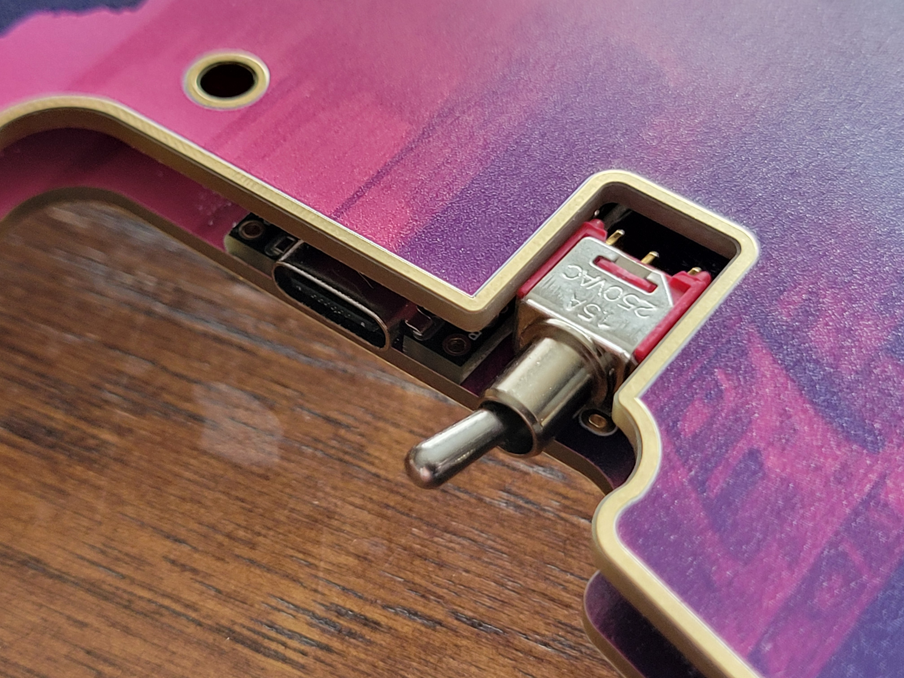

# Desolation
Desolation Keyboard

### [More pictures here](images/gallery.md)

## Features
### V4
- 36 keys
- ZMK Wireless [module](https://github.com/miketronic/zmk-keyboards-desolation/tree/main)
- MX spaced
- Choc or MX switch compatible
- 2x 5-way switches
- 200mAh battery
- Power toggle
- Nice!view ready
- Capable of breaking off on or two columns from both ends to drop down to four or even three columns.

### V3
- 34 keys (plus 4 small tactiles, bonus!)
- ZMK Wireless - I have a [module ready for you to use](https://github.com/miketronic/zmk-keyboards-desolation/tree/main) to make building and flashing your own keymap easier
- Nice!view ready
- 200mAh battery provides several weeks of daily use per charge.
- Capable of breaking off on or two columns from both ends to drop down to four or even three columns.
- Low profile choc switches with CFX spacing (closer spacing then standard choc, only caps of size 16.50mm x 16.50mm will fit)

## Introduction

### V4
I wanted something more for the masses, so the board can accomodate MX or Choc V1 switches (unsure of V2, will test - I've learned that the center post is larger).  As such, it can use any MX or Choc switches and you're not stuck using CFX spaced keycaps (oh how I love their compactness though :) ).  The 5-ways are hidden in a base to hide the ugly and a cap that feels good for the four directions and the press down.
  
  The silkscreen is AI generated using Fotor.com paid subscription with the Neonpunk style.  The prompt was "looking down the street of a desolate city".  It took roughly 40 tries to get the image I chose.

### V3
My first wireless keyboard design, currently on version 3 after some extensive updates.

The image on the board was generating by DeepAI.org using the 'Fantasy World Generator'.  The prompt used was 'a post-apocalyptic city with undead birds', it took probably close to 100 tries to get the image I wanted.

#### Goals/highlights for this build -

  1. Customizable for those who currently use (or want to try dropping down to) four or three columns.  Additionally, if you decide you want to hit the undo button, you can solder the removed columns back on by bodging with the through-holes.
  2. Small 200mAh battery provides a long usage time of weeks before needing to recharge, and hides easily within the case.
  3. Went with a post-apocalyptic feel, with the name of the boad, the silkscreen, and the chunky power switch...oh, and I'm a big fan of birds.

## Keycaps

The below is for V3 ONLY, V4 can use ANY MX or Choc keycap

As noted in the *Features*, I chose a narrower keyswitch spacing and thus they require narrower keycaps.  CFX keycaps are commercially available from Chosfox, or you can print your own, for which I've included files in the keycaps folder.  They easily print upside down on an FDM printer, and I use a textured baseplate.

## Miscellaneous Notes
[My keymap notes](https://github.com/miketronic/MM20-keyboard-layout) if you decide to try a 3 or 4 column variation.

Contact with comments, questions, or sales inquiries!
- m1ketronic @discord
- tufgek@gmail.com
