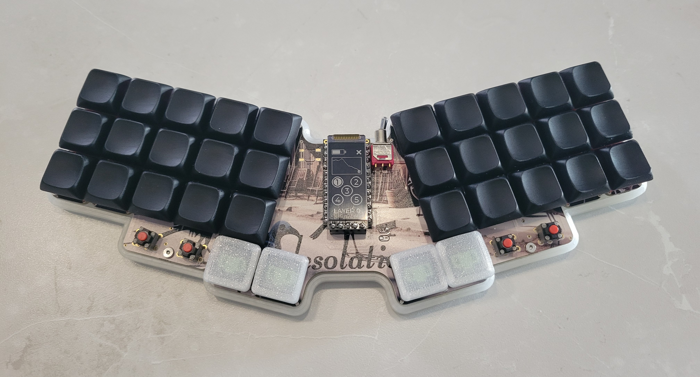

# Desolation
Desolation Keyboard

[More pictures here](images/)

## Features

- 34 keys (plus 4 small tactiles, bonus!)
- ZMK Wireless
- nice!view display
- 200mAh battery provides several weeks of daily use per charge.
- Capable of breaking off on or two columns from both ends to drop down to four or even three columns.
- Low profile choc switches with CFX spacing (closer spacing then standard choc, only caps of size 16.50mm x 16.50mm will fit)

## Introduction

My first wireless keyboard design, currently on version 2 after some tweaks to the initial build.

### Goals/highlights for this build -

  1. Customizable for those who currently use (or want to try dropping down to) four or three columns.  Additionally, if you decide you want to hit the undo button, you can solder the removed columns back on by bodging with the through-holes.
  2. Small 200mAh battery provides a long usage time of weeks before needing to recharge, and hides easily within the case.
  3. Went with a post-apocalyptic feel, with the name of the boad, the silkscreen, and the chunky power switch...oh, and I'm a big fan of birds.

## Keymap

The layout is a larger rendition of my MM20 (3 column) layout with the addition of side columms.  I have no issues with my 20 key layout but it's a BIG change for users and having some keys like tab and backspace on dedicated keys can be convenient.  Of course with custom firmware you are not locked into any specific layout.  If you only want to combo 2 letters (24 non-thumb keys, 26 letters!), then that's totally fine.

The layout, MM28, leverages combos (the yellow letters shown below) for less-used letters, or where they "feel best".  I performed some studies on letter frequency in the English language and most common bigrams and trigrams to determine the letter placement. It kind of started off as Colemak from what I recall, maybe it's actually really different, I forgets.  P and B are weird, they both just barely made it to combos instead of their own letters even though I use them more often then I anticipated.  They could have gone somewhere like the U and W keys but with the frequency I use them I wanted them on my index and middle finger instead of putting all that work on my ring finger.

The biggest thing with starting a layout like this is to accept the fact that you'll start off at like 5wpm but your brain will take over and it'll become second nature eventually just like any other layout.  It's super fun and not making any lateral finger movements feels nice. 

## Keycaps

As noted in the *Features*, I chose a narrower keyswitch spacing and thus they require narrower keycaps.  CFX keycaps are commercially available from Chosfox, or you can print your own, for which I've included files in the keycaps folder.  They easily print upside down on an FDM printer, and I use a textured baseplate.

## Miscellaneous Notes

Contact with comments, questions, or sales inquiries!
- m1ketronic @discord
- tufgek.myshopify.com
- tufgek@gmail.com
