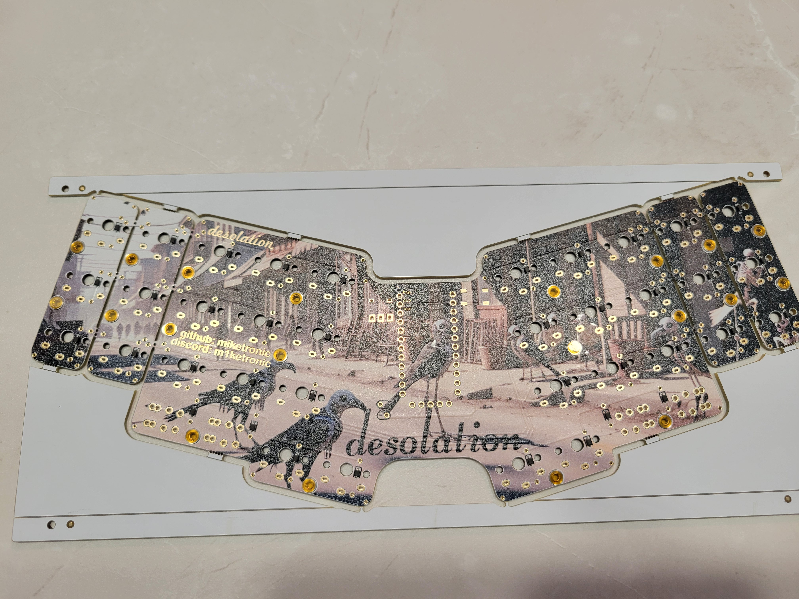

V3 - Hot swap sockets!  More polished.  Longer solder nuts.  Option for power toggle (top or bottom mount) or power button.  Option for soft or tactile reset button, and top or bottom mount.  Able to flush undermount the MCU.

20240714_135049.jpg
20240714_135101.jpg
20240714_135207.jpg
20240715_154604.jpg
20240715_154531.jpg

V3 - Different microswitch options - tactile or soft silent mouse switch.  3D printed caps included.
20240714_142437.jpg
20240714_142459.jpg

